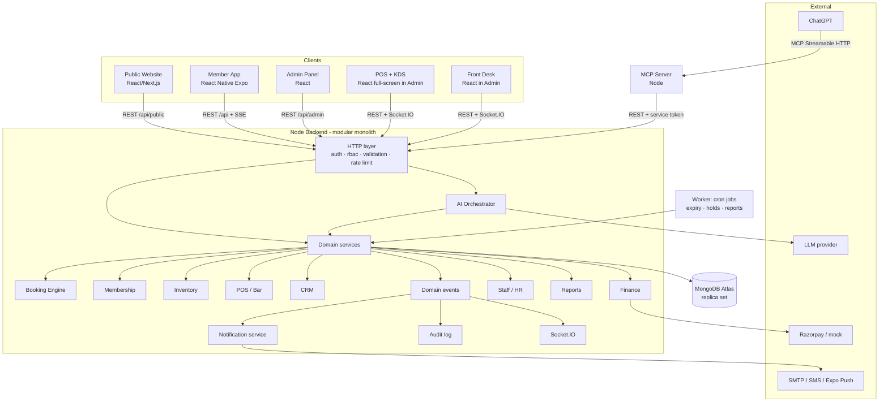

# 02 · Architecture

## 1. Shape of the system

A **modular monolith** Node backend that all clients share. One MongoDB database. A separate small MCP service for ChatGPT. A worker process for scheduled jobs (same codebase, different entrypoint).



## 2. Why these choices

| Decision | Reason |
|---|---|
| Modular monolith, not microservices | Hackathon timeline; transactions across booking + payment + invoice are trivial in one process |
| MongoDB **with transactions** | Atlas is a replica set, so multi-document ACID transactions work. Booking, stock and payments rely on them |
| Unique-index slot locks | The only race-proof way to guarantee "never two people on one court" in MongoDB. See [[08-Booking-Engine]] |
| POS inside the admin app | Same auth, design system and API client; no duplicated code. Full-screen layout at `/pos/*` and `/kds` |
| MCP as a separate service | Different auth model (service token / OAuth), isolates ChatGPT traffic, can be deployed independently. Calls REST so all permission checks and audit still apply |
| AI orchestrator inside the backend | Needs the logged-in member's context and direct service calls; streaming via SSE |
| Socket.IO | Live court board, KDS tickets, table status, low-stock toasts |

## 3. Odoo alignment

This is an Odoo hackathon, but the chosen stack is Node + MongoDB. **Confirm with the organisers whether using Odoo itself is mandatory.** If it is, see [[28-Risks-Extensions#Odoo connector]].

Either way, the domain model deliberately mirrors Odoo apps, so judges recognise the structure and an Odoo sync can be added without remodelling:

| Odoo app / model | Our module / collection | Notes |
|---|---|---|
| Contacts `res.partner` | `customers` (people + companies) | Members, walk-ins, B2B clients, suppliers all reference a customer/partner record |
| Membership `membership.membership_line` | `memberships`, `membershipPlans` | |
| Sales `sale.order` | `orders` (online shop) | |
| Point of Sale `pos.order`, `pos.session`, `pos.config` | `posOrders`, `posSessions`, `posTerminals` | Session = cash drawer shift, Z-report on close, same as Odoo |
| Restaurant tables/floors | `tables`, `floors` | |
| Inventory `stock.quant`, `stock.move` | `stockItems`, `stockMoves` | Every quantity change is a move, like Odoo |
| Purchase `purchase.order` | `purchaseOrders` | |
| CRM `crm.lead` | `leads` | Stages, assignment, activities |
| Accounting `account.move`, `account.payment`, `account.tax` | `invoices` (customer invoice / vendor bill), `payments`, `taxes` | Simplified: no full double-entry chart of accounts; revenue streams + tax summary |
| Employees `hr.employee`, Time Off `hr.leave`, Planning shifts | `employees`, `leaveRequests`, `shifts` | |
| Website / eCommerce | Public website + shop | |
| Appointments / Booking | `courts`, `bookings`, `slotLocks` | Custom (Odoo has no native court engine with these rules) |

Naming in the UI follows Odoo vocabulary where natural: *Session*, *Z-report*, *Vendor bill*, *Pipeline*, *Time off*.

## 4. Repository layout (target)

> VERIFY IN CODEBASE: map these to the real folder names in `D:\odoo2026`. If the existing server is at `backend/` instead of `server/`, keep `backend/`. Record the mapping in `docs/Audit/folder-mapping.md`.

```
D:\odoo2026
├── server/                      # existing Node backend (extend)
│   ├── src/
│   │   ├── app.js               # express app, middleware
│   │   ├── server.js            # http + socket.io bootstrap
│   │   ├── worker.js            # cron entrypoint
│   │   ├── config/              # env loading (zod-validated)
│   │   ├── lib/                 # db, logger, errors, money, time, listQuery, idempotency
│   │   ├── middleware/          # auth, rbac, validate, rateLimit, error handler
│   │   ├── realtime/            # socket.io namespaces
│   │   ├── events/              # domain event bus
│   │   ├── modules/
│   │   │   ├── auth/            # users, roles, permissions, sessions
│   │   │   ├── audit/
│   │   │   ├── settings/        # club settings, locations, taxes
│   │   │   ├── customers/
│   │   │   ├── members/
│   │   │   ├── membership/
│   │   │   ├── facilities/      # sports, courts, schedules, blocks
│   │   │   ├── booking/         # availability, pricing, booking, social play
│   │   │   ├── catalog/         # products, categories, variants
│   │   │   ├── inventory/       # stock items, moves, suppliers, purchase orders
│   │   │   ├── orders/          # online orders: pickup + delivery
│   │   │   ├── pos/             # terminals, sessions, pos orders, tables, tabs, kds
│   │   │   ├── crm/             # leads, activities, quotes, trials
│   │   │   ├── finance/         # invoices, payments, expenses, refunds, tax
│   │   │   ├── hr/              # employees, shifts, attendance, leave, payroll
│   │   │   ├── notifications/
│   │   │   ├── reports/
│   │   │   ├── ai/              # orchestrator, tools, conversations
│   │   │   └── integrations/    # api keys for MCP, payment webhooks
│   │   └── seed/
│   └── test/
├── admin/                       # existing React admin (extend) — also hosts /pos, /kds, /front-desk
├── website/                     # NEW public site
├── mobile/                      # NEW React Native (Expo) member app
├── mcp/                         # NEW management MCP server
├── packages/shared/             # NEW (optional) zod schemas, permission keys, enums, money/time utils
└── docs/
```

Each backend module has the same internal layout:

```
modules/booking/
├── booking.model.js
├── slotLock.model.js
├── booking.schemas.js      # zod
├── availability.service.js
├── pricing.service.js
├── booking.service.js
├── booking.controller.js
├── booking.routes.js       # mounts /api/bookings and /api/admin/bookings
├── booking.events.js       # emitted event names + payload types
└── __tests__/
```

### Shared package

If the repo isn't already a workspace, `packages/shared` can be a plain folder consumed via relative import or `file:` dependency. Contents: permission keys, enums (statuses), zod schemas used by both server and admin, money and time helpers. **Don't let this become a reason for a big refactor**: if wiring workspaces is painful, duplicate the enums file and add a test that asserts they match.

## 5. Website choice

The problem says strangers "search for a place to play near them". That's SEO. Recommended: **Next.js** (React, App Router, server-rendered pages that call the public API). Fallback if the team wants one toolchain: Vite React + prerendering of static pages. Record the choice in an ADR.

## 6. Request lifecycle (backend)

```
request
 → requestId + logger child
 → helmet, cors (allowlist), json body limit
 → rateLimit (per IP; stricter on /auth, /public, /ai)
 → authenticate (JWT access token | MCP service token | none for /public)
 → requirePermission('booking.create')
 → validate(zodSchema) for params/query/body
 → controller (thin) → service (rules, transaction) → model
 → events.emit → audit / notifications / socket
 → response envelope { data, meta } or error { error: { code, message, details } }
```

## 7. Domain events (in-process)

Emitted by services after a transaction **commits** (never inside it). Consumers must be idempotent.

| Event | Consumers |
|---|---|
| `member.created` | notifications (welcome), activity timeline |
| `membership.activated` / `.expiring` / `.expired` | notifications, timeline, dashboard cache |
| `booking.confirmed` / `.cancelled` / `.checked_in` | socket `court-board`, notifications, timeline |
| `order.placed` / `.ready_for_pickup` / `.collected` / `.out_for_delivery` / `.delivered` | notifications, socket |
| `pos.order.sent_to_kitchen` / `.item_ready` | socket `kds`, socket `pos` |
| `stock.low` | notifications (manager), socket |
| `lead.created` / `.assigned` / `.overdue` | notifications to assignee |
| `payment.captured` / `.refunded` | finance, timeline |
| `leave.requested` / `.decided` | notifications |

Implementation: a tiny `EventEmitter` wrapper with `emitAfterCommit(session, name, payload)`. **[RE]** Swap for a queue (BullMQ + Redis) only if needed after the hackathon.
