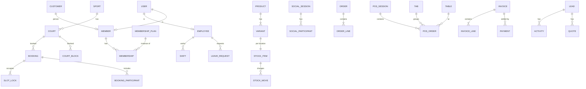

# 04 · Database Schema (MongoDB + Mongoose)

Database: `odoo2026` on Atlas. Connection string comes **only** from `MONGODB_URI` in `.env`.

## Global conventions

- Collection names: camelCase plural (`membershipPlans`). Mongoose model names: PascalCase singular.
- Every document: `createdAt`, `updatedAt` (`timestamps: true`), `createdBy`, `updatedBy` (`ObjectId → users`, optional for system writes).
- `locationId` on every operational document (single location seeded; enables multi-location later).
- **Money:** integer paise, field names end in `Paise` (`pricePaise`). Display formatting in the client only.
- **Dates:** `Date` in UTC. Day-based rules also store `localDate: "YYYY-MM-DD"` in `Asia/Kolkata`.
- **Soft delete:** `archivedAt: Date | null` on master data (products, plans, courts, members, employees). Transactions (bookings, invoices, payments, stock moves, pos orders) are **never** deleted — they are cancelled/voided/reversed.
- **Human-readable numbers:** `counters` collection `{ _id: "invoice:2026", seq }` with `findOneAndUpdate($inc)` → `INV-2026-00042`. Used for member codes, invoices, orders, bookings, POS receipts.
- **Snapshots:** documents that record a sale copy the price, tax and discount used at that time (never re-read from the plan/product later).
- Atlas tier must support transactions (all replica sets do, including M0 free tier).

## Entity map



---

## A. Identity and access

### `users`
| Field | Type | Notes |
|---|---|---|
| email | String, lowercase | unique sparse |
| phone | String E.164 | unique sparse |
| passwordHash | String | existing algorithm (VERIFY) |
| kind | enum `staff` \| `member` | |
| roleIds | [ObjectId → roles] | staff only |
| memberId | ObjectId → members | member only |
| employeeId | ObjectId → employees | staff only |
| status | enum `active` \| `disabled` | |
| lastLoginAt | Date | |
| tokenVersion | Number | increment to revoke all refresh tokens |
| pushTokens | [{token, platform, updatedAt}] | Expo push |

Indexes: `{email:1}` unique sparse, `{phone:1}` unique sparse.
> VERIFY IN CODEBASE: extend the existing User model rather than replacing it.

### `roles`
`{ key: "front_desk", name, description, permissions: [String], isSystem: Boolean }` — unique `key`. See [[06-Auth-RBAC]].

### `refreshTokens` (if existing auth lacks one)
`{ userId, tokenHash, userAgent, ip, expiresAt, revokedAt }` — TTL index on `expiresAt`.

### `apiKeys` (for MCP)
`{ name, keyHash, prefix, actingUserId, scopes: [String], lastUsedAt, revokedAt, expiresAt }` — unique `prefix`.

### `auditLogs`
| Field | Notes |
|---|---|
| at | Date |
| actor | `{ type: user\|apiKey\|system\|ai, id, name }` |
| source | `admin` \| `pos` \| `front_desk` \| `website` \| `mobile` \| `ai` \| `mcp` \| `worker` |
| action | `booking.cancel` |
| entity | `{ type: "booking", id, label: "BK-2026-00123" }` |
| before / after | Mixed (diff of changed fields only, secrets stripped) |
| reason | String (required for cancellations, refunds, voids, stock adjustments) |
| ip, userAgent, requestId | |

Indexes: `{at:-1}`, `{"entity.type":1,"entity.id":1,at:-1}`, `{"actor.id":1,at:-1}`, `{source:1,at:-1}`. Append-only (no update/delete routes).

---

## B. Club setup

### `locations`
`{ name, code, address, timezone: "Asia/Kolkata", phone, gstin, openingHours: [{dow 0-6, open "06:00", close "23:00"}] }`

### `settings` (singleton per location)
`{ locationId, currency: "INR", bookingCancelFreeHours: 4, holdMinutes: 10, maxAdvanceDays: 14, walkInRequiresPhone: true, lowStockDefault: 5, invoicePrefix, receiptFooter, ... }`

### `taxes`
`{ name: "GST 18%", ratePct: 18, components: [{name:"CGST", ratePct:9},{name:"SGST", ratePct:9}], appliesTo: ["court","membership","shop","bar"], active }`
> Rates are **configurable seed data**. Verify current GST rates for each category with an accountant before go-live; do not hard-code.

---

## C. Customers, members, memberships

### `customers` (Odoo `res.partner` equivalent)
`{ type: person|company, name, email, phone, gstin?, billingAddress, addresses: [{label, line1, line2, city, state, pincode, phone, isDefault}], tags, notes, archivedAt }`
Every member, walk-in who gave details, B2B client and supplier has a customer record. Indexes: `{phone:1}`, `{email:1}`, text `{name, email, phone}`.

### `members`
| Field | Notes |
|---|---|
| memberCode | `CC-000123`, unique |
| customerId | → customers, unique |
| userId | → users (nullable until they activate the app) |
| firstName, lastName, dob, gender | `dob` required (Junior rule) |
| phone, email | denormalised from customer for fast search |
| photoUrl | |
| emergencyContact | `{name, phone, relation}` |
| guardian | `{name, phone, email}` — required if age < 18 |
| currentMembershipId | → memberships (denormalised pointer) |
| tierKey | `gold`/`silver`/`junior`/`none` (denormalised for filters) |
| status | `active` \| `expired` \| `suspended` \| `prospect` |
| membershipEndDate | denormalised |
| walletBalancePaise | Number, ≥ 0 [RE] |
| loyaltyPoints | Number [RE] |
| source | `front_desk` \| `website` \| `mobile` \| `lead_conversion` |
| archivedAt | |

Indexes: unique `memberCode`; `{phone:1}`; `{email:1}`; text index on `firstName lastName phone email memberCode`; `{status:1, membershipEndDate:1}`; `{tierKey:1}`.

### `membershipPlans`
| Field | Notes |
|---|---|
| key | `gold`, `silver`, `junior` (unique among active versions) |
| name, description, colour | |
| version | Number; editing a plan in use creates version+1, old one archived |
| durations | `[{months: 1, pricePaise}, {months: 3, ...}, {months: 12, ...}]` |
| eligibility | `{minAge?, maxAge?}` — Junior `{maxAge: 17}` |
| entitlements | see below |
| taxId | |
| active, sortOrder, archivedAt | |

```js
entitlements: {
  court: {
    access: "all" | "off_peak_only" | "none",
    pricing: { mode: "free" | "discount_pct" | "fixed_paise", value: Number },
    maxBookingsPerDay: 2,         // [PS] "at most twice a day"
    advanceBookingDays: 14,       // Gold may get longer
    sportKeys: ["tennis","padel","badminton","cricket"] // empty = all
  },
  shopDiscountPct: 10,
  barDiscountPct: 10,
  guestPasses: 0,                 // [RE]
  perks: ["Locker", "Free towel"] // display only
}
```

Seed (placeholder values — owner edits them in admin):

| Plan | Court | Shop | Bar | Max/day |
|---|---|---|---|---|
| Gold (premium, full access) | free, all hours | 15% | 15% | 2 |
| Silver (standard) | 50% off, all hours | 10% | 10% | 2 |
| Junior (<18, discounted) | 50% off, off-peak only | 10% | 0% (no alcohol, enforced by product flag) | 2 |

### `memberships`
| Field | Notes |
|---|---|
| memberId, planId, planKey, planVersion | |
| entitlementsSnapshot | copy of plan.entitlements at purchase |
| startDate, endDate | `Date` + `startLocalDate`, `endLocalDate` |
| status | `pending_payment` \| `active` \| `expired` \| `cancelled` \| `upgraded` |
| pricePaise, durationMonths | snapshot |
| invoiceId | |
| renewalOfId | → memberships |
| autoRenew | Boolean [RE] |
| reminderSentAt | `{d30, d7, d1, d0}` |
| cancelledAt, cancelReason | |

Indexes: `{memberId:1, startDate:-1}`; `{status:1, endDate:1}` (expiry job); **partial unique** `{memberId:1}` where `status: "active"` → a member can't have two active memberships.

### `activityEvents` (member timeline)
`{ memberId, at, type: "booking.confirmed", title, refType, refId, amountPaise?, source }` — index `{memberId:1, at:-1}`. Written by event consumers. The member 360 view reads this one collection instead of joining six.

---

## D. Facilities and booking

### `sports`
`{ key: "tennis", name, icon, sessionMinutes: 60, slotStepMinutes: 30, active }`

### `courts`
| Field | Notes |
|---|---|
| sportId, name ("Tennis Court 1"), code | |
| surface, indoor, floodlit | |
| status | `active` \| `maintenance` \| `archived` |
| operatingHours | override of location hours, `[{dow, open, close}]` |
| pricing | `{ walkInPaise: {peak, offPeak}, peakWindows: [{dow:[1..5], from:"17:00", to:"22:00"}], memberBasePaise: {peak, offPeak} }` |
| allowSocialPlay | Boolean |
| capacity | players (for social play) |

### `courtBlocks`
`{ courtId, start, end, reason: maintenance|event|coaching|social_play|tournament, note, socialSessionId? }` — index `{courtId:1, start:1, end:1}`. Creating a block also inserts slot locks (`kind: "block"`) so bookings can't land there (see booking engine).

### `slotLocks` — **the concurrency guarantee**
| Field | Notes |
|---|---|
| courtId | |
| slotStart | `Date`, aligned to 30-min boundary (UTC) |
| kind | `booking` \| `hold` \| `block` \| `social` |
| refId | bookingId / courtBlockId / socialSessionId |
| expiresAt | set **only** for `hold`; TTL index deletes stale holds |

Indexes:
- **unique `{courtId:1, slotStart:1}`** ← the invariant "never two on one court"
- TTL `{expiresAt:1}` with `expireAfterSeconds: 0` (docs without `expiresAt` are never TTL-deleted)
- `{refId:1}`

> TTL deletion runs roughly every 60 s, so the availability service must **also** treat `hold` locks with `expiresAt < now` as free, and the booking service deletes expired holds for the target slots inside its transaction before inserting. See [[08-Booking-Engine]].

### `bookings`
| Field | Notes |
|---|---|
| bookingNo | `BK-2026-00123` |
| courtId, sportId, locationId | |
| start, end, localDate | |
| slotStarts | [Date] — the 30-min units it occupies |
| type | `member` \| `walk_in` \| `trial` \| `admin` \| `coaching` |
| bookedByMemberId | nullable for walk-in |
| customer | `{ customerId?, name, phone }` for walk-in / trial |
| participants | `[{memberId?, name, isGuest}]` |
| channel | `mobile` \| `website` \| `front_desk` \| `phone` \| `ai` \| `mcp` |
| status | `held` \| `confirmed` \| `checked_in` \| `completed` \| `cancelled` \| `no_show` \| `expired` |
| price | `{ basePaise, discountPaise, taxPaise, totalPaise, rule: "gold_free" }` |
| paymentStatus | `unpaid` \| `paid` \| `pay_at_desk` \| `refunded` \| `partially_refunded` \| `not_required` |
| paymentIds, invoiceId | |
| holdExpiresAt | |
| cancellation | `{ at, by, reason, refundPaise, refundMethod: original|wallet|none }` |
| idempotencyKey | unique sparse |
| membershipId | membership used (snapshot linkage) |

Indexes: `{courtId:1, start:1}`; `{bookedByMemberId:1, start:-1}`; `{localDate:1, status:1}`; `{status:1, holdExpiresAt:1}`; unique sparse `idempotencyKey`.

### `memberDayCounters` — daily limit guard
`{ memberId, localDate, count }` — **unique `{memberId:1, localDate:1}`**. Incremented in the booking transaction with a guard; decremented on cancellation.

### `socialSessions`
`{ courtIds, sportId, start, end, title: "Friday Social", capacity, pricePerPlayer: {memberPaise, guestPaise}, joinedCount, status: open|full|cancelled|completed, membersOnly }` + `socialParticipants { sessionId, memberId?, name, phone, paymentStatus, joinedAt }` with unique `{sessionId, memberId}` (sparse).

---

## E. Catalogue, inventory, purchasing

### `productCategories`
`{ name, slug (unique), parentId, channel: shop|bar|both, sortOrder, image }` — seed: Rackets, Balls, Shoes, Accessories, Apparel, Strings & Grips (shop); Hot drinks, Cold drinks, Snacks, Meals (bar).

### `products`
| Field | Notes |
|---|---|
| name, slug (unique), description, brand, images | |
| categoryId | |
| channels | `{ shop: true, online: true, bar: false }` |
| kind | `stocked` \| `service` (e.g. "Restringing") \| `consumable_menu` (bar items without stock tracking) |
| taxId | |
| memberDiscountEligible | Boolean |
| ageRestricted | Boolean (alcohol; blocks Junior) |
| kitchenStation | `bar` \| `kitchen` \| null (KDS routing) |
| archivedAt | |

### `variants`
`{ productId, sku (unique), barcode (unique sparse), attributes: {size: "UK 9", colour: "White"}, pricePaise, costPaise, compareAtPaise?, active }`
Simple products have exactly one variant.

### `stockItems`
`{ variantId, locationId, onHand, reserved, reorderLevel, reorderQty }` — unique `{variantId, locationId}`. **Available = onHand − reserved.**
Index `{locationId:1}` + query for low stock `$expr: {$lte: [{$subtract:["$onHand","$reserved"]}, "$reorderLevel"]}` (small collection; fine).

### `stockMoves` (append-only ledger)
`{ variantId, locationId, qty (+/-), type: purchase_receipt|sale_pos|sale_online|reserve|release|return|adjustment|transfer|damage, refType, refId, reason, at, by, onHandAfter }` — index `{variantId:1, at:-1}`, `{refType:1, refId:1}`.

### `suppliers` → use `customers` with `tags: ["supplier"]` plus `supplierInfo {leadTimeDays, paymentTermsDays}` embedded. (Odoo-style single partner table.)

### `purchaseOrders`
`{ poNo, supplierId, lines: [{variantId, qty, unitCostPaise, receivedQty}], status: draft|sent|partially_received|received|cancelled, expectedDate, billId (vendor bill invoice) }`

---

## F. Online orders (click & collect, delivery)

### `carts` (mobile/web, logged-in)
`{ userId, lines: [{variantId, qty}], updatedAt }` — TTL 30 days after update.

### `orders`
| Field | Notes |
|---|---|
| orderNo | `SO-2026-00042` |
| memberId?, customerId, contact | |
| channel | `website` \| `mobile` \| `ai` \| `front_desk` |
| fulfilment | `pickup` \| `delivery` |
| lines | `[{variantId, productName, sku, qty, unitPricePaise, discountPaise, taxPaise, totalPaise}]` (snapshot) |
| totals | `{subtotalPaise, discountPaise, taxPaise, deliveryFeePaise, totalPaise}` |
| status | see state machine in [[10-Shop-Inventory-Orders]] |
| pickup | `{ code: "4F7K2", readyAt, collectedAt, collectedBy, preferredDate }` |
| delivery | `{ address, slot, courier, trackingRef, dispatchedAt, deliveredAt, proof }` |
| paymentStatus, paymentIds, invoiceId | |
| reservationExpiresAt | unpaid orders release stock after N minutes |
| history | `[{at, status, by, note}]` |

Indexes: `{status:1, fulfilment:1, createdAt:-1}`, `{memberId:1, createdAt:-1}`, unique `orderNo`, unique `pickup.code` sparse among open orders (generate + retry).

---

## G. POS, bar, cafeteria

### `posTerminals`
`{ name: "Bar Counter 1", mode: bar|shop|front_desk, locationId, defaultPrinter?, allowedPaymentMethods: [cash, card, upi, tab, wallet] }`

### `posSessions` (Odoo-style shift session)
`{ sessionNo, terminalId, openedBy, openedAt, openingCashPaise, closedBy, closedAt, countedCashPaise, expectedCashPaise, differencePaise, status: open|closing|closed, zReport: {...totals by method/category} }` — **partial unique `{terminalId}` where `status: "open"`** (one open session per terminal).

### `floors`, `tables`
`floors {name, sortOrder}`; `tables {floorId, name: "T12", seats, shape, x, y, status: free|occupied|bill_requested|reserved, currentTabId}`.

### `tabs`
`{ tabNo, name ("Rahul – Court 3"), memberId?, tableId?, openedBy, openedAt, status: open|settled|void, balancePaise, posOrderIds, limitPaise? }` — index `{status:1}`.

### `posOrders`
| Field | Notes |
|---|---|
| receiptNo | `R-BAR1-000123` |
| sessionId, terminalId, mode | |
| tableId?, tabId?, memberId? | |
| lines | `[{lineId, variantId?, productId, name, qty, unitPricePaise, modifiers: [{name, pricePaise}], note, guestLabel?, discountPaise, taxPaise, totalPaise, kitchenStatus: new|in_progress|ready|served|void, station}]` |
| totals | as orders |
| discount | `{ source: membership|manual, pct, approvedBy? }` |
| status | `open` \| `sent` \| `paid` \| `on_tab` \| `void` \| `refunded` |
| payments | `[{method, amountPaise, ref, paymentId}]` (split) |
| clientOrderId | **unique** — idempotency from the tablet |

Indexes: unique `clientOrderId`, `{sessionId:1}`, `{tabId:1}`, `{createdAt:-1}`, `{"lines.kitchenStatus":1}` partial where status in [open, sent].

---

## H. CRM

### `leads`
| Field | Notes |
|---|---|
| leadNo | |
| name, email, phone | |
| source | `website_form` \| `trial_booking` \| `phone` \| `walk_in` \| `ai_chat` \| `referral` |
| interest | `["membership:gold", "coaching", "court_hire", "corporate"]` |
| message | |
| stage | `new` \| `contacted` \| `trial_scheduled` \| `trial_done` \| `quoted` \| `won` \| `lost` |
| assignedTo | → users |
| nextActionAt, nextActionNote | |
| lastContactAt | |
| slaDueAt | `createdAt + settings.leadSlaHours` |
| lostReason | |
| convertedMemberId | |
| trialBookingId | |
| companyName | for B2B / corporate enquiries |

Indexes: `{stage:1, assignedTo:1}`, `{nextActionAt:1}`, `{slaDueAt:1, stage:1}`, `{phone:1}`, `{email:1}`.

### `leadActivities`
`{ leadId, type: call|email|whatsapp|note|meeting|stage_change|quote_sent, at, by, summary, outcome }`

### `quotes`
`{ quoteNo, leadId?, customerId?, lines: [{description, planId?, qty, unitPricePaise, taxId}], totals, validUntil, status: draft|sent|accepted|rejected|expired, sentAt, acceptedAt, publicToken (for accept link) }`

---

## I. Finance

### `invoices` (customer invoices **and** vendor bills, like Odoo `account.move`)
| Field | Notes |
|---|---|
| number | `INV-2026-00042` / `BILL-2026-00007` / `CN-…` for credit notes |
| kind | `customer_invoice` \| `vendor_bill` \| `credit_note` |
| customerId | partner |
| sourceType, sourceId | `membership` \| `booking` \| `order` \| `pos_order` \| `quote` \| `manual` \| `purchase_order` \| `payroll` |
| lines | `[{description, revenueStream: court|membership|shop|bar|social|coaching|delivery|other, qty, unitPricePaise, discountPaise, taxId, taxPaise, taxBreakdown:[{name, ratePct, amountPaise}], totalPaise}]` |
| totals | `{subtotalPaise, discountPaise, taxPaise, totalPaise, paidPaise, duePaise}` |
| issueDate, dueDate, localDate | |
| status | `draft` \| `posted` \| `partially_paid` \| `paid` \| `void` |
| reversalOfId | for credit notes |
| pdfUrl | |

Indexes: unique `number`; `{kind:1, status:1, dueDate:1}`; `{customerId:1, issueDate:-1}`; `{localDate:1}`; `{"lines.revenueStream":1, localDate:1}`.

**Posting rule:** invoices are immutable after `posted`. Corrections = credit note.

### `payments`
`{ paymentNo, direction: in|out, method: cash|card|upi|online|wallet|bank_transfer, amountPaise, provider: razorpay|mock|manual, providerRef, status: pending|captured|failed|refunded|partially_refunded, invoiceIds, sourceType, sourceId, posSessionId?, receivedBy, at, localDate, refunds: [{amountPaise, at, providerRef, reason, by}] }`
Indexes: `{localDate:1, method:1}`, `{providerRef:1}` unique sparse, `{status:1}`.

### `expenses`
`{ category: utilities|maintenance|salaries|supplies|marketing|rent|other, vendorId?, amountPaise, taxPaise, date, localDate, paidVia, receiptUrl, billId?, note }`

### `walletTransactions` [RE]
`{ memberId, amountPaise (+/-), type: topup|refund_credit|spend|adjustment, refType, refId, balanceAfterPaise, at, by }` — member balance updated atomically with `$inc` and guard `walletBalancePaise >= amount` for spends.

---

## J. HR

### `employees`
`{ employeeCode, userId?, name, phone, email, department: front_desk|bar|kitchen|shop|coaching|maintenance|management|finance, jobTitle, joinDate, salary: {type: monthly|hourly, amountPaise}, bank: {accountLast4, ifsc} (no full account numbers in plain text), leaveBalances: {casual: 12, sick: 6, earned: 0}, status: active|on_leave|exited, archivedAt }`

### `shifts`
`{ employeeId, locationId, department, start, end, localDate, role, status: scheduled|completed|missed, note }` — index `{localDate:1, department:1}`, `{employeeId:1, start:1}`. Overlap check in service.

### `attendance`
`{ employeeId, shiftId?, clockInAt, clockOutAt, source: pos_login|manual|kiosk, minutes }`

### `leaveRequests`
`{ employeeId, type: casual|sick|earned|unpaid, from, to, days, reason, status: pending|approved|rejected|cancelled, decidedBy, decidedAt, decisionNote }`

### `payrollRuns`
`{ period: "2026-10", status: draft|approved|paid, lines: [{employeeId, basePaise, overtimePaise, allowancesPaise, deductionsPaise, unpaidLeaveDays, netPaise}], totalPaise, approvedBy, paymentIds }`

---

## K. Notifications, AI, misc

### `notifications`
`{ userId?, channel: in_app|email|sms|push, template, data, title, body, status: queued|sent|failed|read, attempts, sendAfter, sentAt, readAt, error }` — index `{userId:1, createdAt:-1}`, `{status:1, sendAfter:1}`.

### `notificationTemplates`
`{ key: "membership.expiring_7d", channel, subject, body (handlebars), active }`

### `aiConversations`
`{ userId, title, channel: mobile|website|admin, lastMessageAt, archivedAt }`

### `aiMessages`
`{ conversationId, role: user|assistant|tool, content, toolCalls: [{id, name, args, status, resultSummary}], pendingAction?: {actionId, tool, args, summary, expiresAt}, tokens: {in, out}, createdAt }`

### `pendingActions` (shared by AI and MCP confirmations)
`{ actionId (random 128-bit), actor, source: ai|mcp, tool, args, summary, expiresAt (TTL 10 min), status: pending|confirmed|cancelled|expired, resultRef }`

### `idempotencyKeys`
`{ key, scope (route), userId, requestHash, response, status, createdAt }` — unique `{scope, key}`, TTL 24 h.

### `counters`
`{ _id: "booking:2026", seq }`

---

## Index creation

- Define all indexes in the schema (`schema.index(...)`).
- In production, set `autoIndex: false` and run `npm run db:indexes` (script calls `Model.syncIndexes()` for every model) during deploy.
- `test/indexes.test.js` asserts the critical unique indexes exist: `slotLocks{courtId,slotStart}`, `memberDayCounters{memberId,localDate}`, `stockItems{variantId,locationId}`, `posOrders{clientOrderId}`, `memberships` partial active, `posSessions` partial open.
