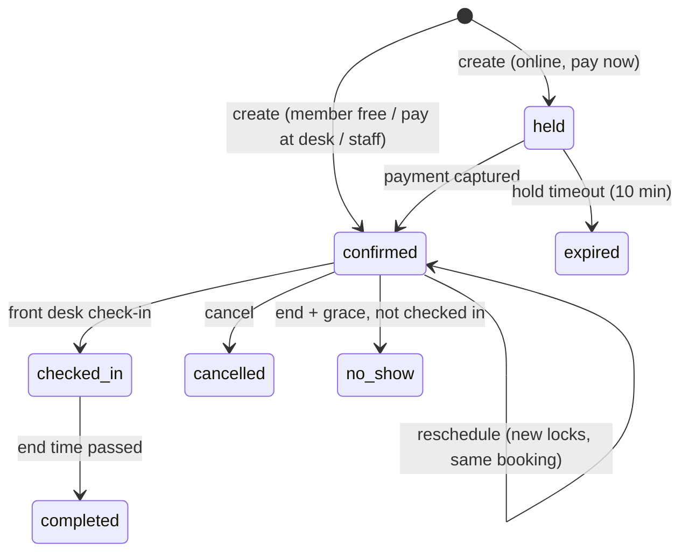

# 08 · Booking Engine ⚠️ critical

Problem statement: *"Sessions last an hour, a new slot opens every half hour, and each member can play at most twice a day. Members pay less than walk-ins, or nothing at all, depending on their plan. Plans change, people cancel, and on Friday night the courts open up for social play where many people share one court. Through all of it, two people must never end up on the same court at the same time."*

## 1. Core model: slot units

- Time is cut into **30-minute units** aligned to `:00` and `:30` (`slotStepMinutes`).
- A session is **60 minutes** (`sessionMinutes`) = 2 consecutive units.
- Start times are offered every 30 minutes: 18:00, 18:30, 19:00 …
- A booking 18:30–19:30 occupies units `18:30` and `19:00`. So 18:00–19:00 and 18:30–19:30 on the same court **overlap** and must conflict — the unit model makes that automatic.
- Everything that occupies a court (booking, hold, block, social session) inserts one `slotLocks` document **per unit**.
- `slotLocks` has a **unique index on `{courtId, slotStart}`**. MongoDB guarantees only one insert per key wins, across any number of concurrent requests, servers or clients.

## 2. Availability (`AvailabilityService`)

`getAvailability({ sportId?, courtIds?, localDate, forMember? })`

1. Load courts (active, sport filter) — cached 60 s.
2. Compute operating window per court for that `localDate` (court hours ?? location hours), in club TZ, convert to UTC.
3. Generate candidate start times every `slotStepMinutes` where `start + sessionMinutes <= close` and `start > now + settings.minLeadMinutes`.
4. **One query** for locks: `slotLocks.find({ courtId: {$in}, slotStart: {$gte: dayStart, $lt: dayEnd} }).lean()`; ignore `hold` locks with `expiresAt < now`.
5. A start time is available if **both** units are unlocked.
6. If `forMember`: annotate each slot with price (`PricingService`), `allowed` (entitlement: off-peak only for Junior, advance window), and member's remaining daily bookings.
7. Return grid `{ courts: [{courtId, name, slots: [{start, end, status: available|booked|held|blocked|social|past, pricePaise?, allowed?, reason?}]}] }`.

Public (website) variant returns statuses only — no names, no booking ids.

Performance: one day × 10 courts × 34 units = ~340 lock docs; indexed range query < 10 ms. Cache the computed grid per `{locationId, localDate}` for 5 s, invalidated by `slot.locked/released` events.

## 3. Pricing (`PricingService.courtPrice`)

```
base = court.pricing.walkInPaise[peak|offPeak]            // walk-in, trial, non-member
if member with active membership:
  memberBase = court.pricing.memberBasePaise[peak|offPeak]
  switch entitlements.court.pricing.mode:
    free          -> 0                                     // Gold
    discount_pct  -> memberBase × (1 − value/100)          // Silver/Junior
    fixed_paise   -> value
trial booking   -> settings.trialPricePaise (may be 0)
admin override  -> requires booking.edit + reason, audited
tax via court tax → computeLine()
```

Peak = slot start inside any `court.pricing.peakWindows` for that weekday. The returned object includes `rule` (e.g. `"silver_50pct_peak"`) shown on receipts so staff can explain the price.

## 4. Booking lifecycle



## 5. Create booking (`BookingService.create`) — exact algorithm

Input: `{ courtId, startUtc, type, memberId?, customer?, participants?, channel, payment: { mode: 'online'|'free'|'desk'|'cash'|'card'|'upi'|'wallet' }, idempotencyKey }`

**Pre-transaction (read-only) validation:**
1. Court exists, `status: active`, sport active.
2. `startUtc` aligned to 30 min; `end = start + sessionMinutes`.
3. Inside operating hours; not in the past; within `entitlements.court.advanceBookingDays` (or `settings.maxAdvanceDays` for walk-ins).
4. If member booking: active membership (or allow as non-member at walk-in price — configurable; default: a member with expired membership books at walk-in price, and the UI tells them why).
5. Entitlement: `canBookCourt` (e.g. Junior off-peak only → `ENTITLEMENT_DENIED`).
6. Price computed.

**Transaction (`withTransaction`)**:
```js
units = [start, start+30m]
// a) clear stale holds on these units (TTL may lag)
await SlotLock.deleteMany({ courtId, slotStart: {$in: units}, kind: 'hold', expiresAt: {$lt: now} }, {session})

// b) enforce daily limit for member bookings
//    BEFORE the transaction (idempotent, outside txn):
//      await MemberDayCounter.updateOne({ memberId, localDate },
//            { $setOnInsert: { count: 0 } }, { upsert: true })
//    so the counter doc always exists and the guarded update below never upserts.
if (memberId) {
  const r = await MemberDayCounter.findOneAndUpdate(
     { memberId, localDate, count: { $lt: maxPerDay } },
     { $inc: { count: 1 } },
     { new: true, session })
  if (!r) throw Conflict('DAILY_LIMIT_REACHED', `You already have ${maxPerDay} bookings on ${localDate}.`)
  // concurrent increments on the same doc inside transactions raise WriteConflict
  // (transient) -> withTransaction retries -> the guard is re-evaluated. Race-safe.
}

// c) create booking doc (status held|confirmed)
const booking = await Booking.create([{...}], {session})

// d) insert locks — the atomic guarantee
await SlotLock.insertMany(units.map(u => ({
   courtId, slotStart: u, kind: isHold ? 'hold' : 'booking', refId: booking._id,
   ...(isHold && { expiresAt: holdExpiresAt })
})), { session, ordered: true })
// E11000 on {courtId, slotStart} -> throw Conflict('SLOT_UNAVAILABLE') -> whole txn aborts:
// booking doc and counter increment roll back automatically.

// e) if paid at desk / cash: create payment + invoice (revenueStream court) in same txn
// f) audit (inside txn for money)
```

**After commit:** emit `booking.confirmed` or `booking.held`; socket `slot.locked`; notification.

Error translation: wrap E11000 by index name — `courtId_1_slotStart_1` → `SLOT_UNAVAILABLE` (include `details.alternatives` = next 3 free starts on that court + same time on other courts of the same sport, computed after abort). Inside a transaction, two concurrent inserts of the same lock key can also surface as a `WriteConflict` that `withTransaction` retries; on retry the committed lock is visible and the insert fails with E11000 → `SLOT_UNAVAILABLE`. Either way exactly one request wins.

> `session.withTransaction` retries transient errors; E11000 is **not** transient, so it surfaces immediately. Good.

### Why not "check then insert"?
Two requests can both "check" and see the slot free, then both insert. Only a **unique index** (or a single-document atomic op) closes that gap. The availability query is for display only; the unique index is the guard.

## 6. Payment flow (no payment before reservation; no reservation without payment)

Online (mobile/website/AI) when price > 0:
1. `POST /api/bookings` → transaction above with `status: held`, hold locks with `expiresAt = now + holdMinutes (10)`. Response includes `booking` + `paymentIntent` (Razorpay order id created **after** commit; if provider call fails → booking stays held and client can retry `POST /api/bookings/:id/pay`).
2. Client pays (Razorpay checkout: card/UPI).
3. Confirmation via **webhook** `payment.captured` (source of truth) and/or client `POST /api/bookings/:id/confirm-payment` with signature (verified server-side).
4. `confirmPayment` transaction: booking must be `held` and `holdExpiresAt > now` → convert locks `kind: hold → booking`, `$unset expiresAt`; create payment + invoice; status `confirmed`. Idempotent on `providerRef`.
5. If payment arrives after expiry (`HOLD_EXPIRED`): try to re-lock the same units in a new transaction; if free → confirm; if taken → auto refund (or wallet credit) + notify. This is the "payment-before-reservation / expired reservation" edge case.

Hold expiry worker: every minute, `held` with `holdExpiresAt < now` → `expired`, delete hold locks, decrement day counter (all in one transaction).

`mock` payment provider (demo): `POST /api/payments/mock/:intentId/succeed` triggers the same confirm path. Enabled only when `PAYMENTS_PROVIDER=mock`.

## 7. Cancel (`BookingService.cancel`)

- Member self-cancel allowed until `start − settings.bookingCancelFreeHours` → full refund (to original method or wallet, per settings). Later → no refund (staff can override with `booking.refund`, audited with reason).
- Transaction: status `cancelled`, `deleteMany` slot locks by `refId`, decrement day counter (`$inc -1` with `count > 0` guard), create refund record/credit note.
- After commit: `slot.released` socket → slot instantly visible to the next person; notification.

## 8. Reschedule

Single transaction: insert new locks first (fails cleanly with `SLOT_UNAVAILABLE` if taken), then delete old locks, update booking times, adjust price difference (charge or credit). Daily counter moves if the date changes (decrement old date, guarded increment new date).

## 9. Court blocks

`CourtBlockService.create({courtId, start, end, reason})` inserts `kind: block` locks for every unit. If units already have bookings → return conflicts list; the manager chooses "cancel and notify affected bookings" (`booking.cancel` perm, bulk) or adjust times. Remove block → delete locks.

## 10. Social play (Friday night)

- Manager creates a `socialSession` (e.g. Fri 19:00–22:00, Courts 3–4, capacity 16, ₹200 member / ₹350 guest). This inserts `kind: social` locks on those courts, so no private bookings can land there.
- People **join** the session, not a court: transaction with `socialSessions.findOneAndUpdate({_id, status: 'open', joinedCount: {$lt: capacity}}, {$inc: {joinedCount: 1}})` → if null → `SESSION_FULL`; then insert `socialParticipants` (unique `{sessionId, memberId}` prevents double join). When `joinedCount == capacity` → `status: full`.
- Social participation **does not** count toward the 2-bookings/day limit by default (`settings.socialCountsTowardLimit = false`); configurable.
- Front desk can add walk-in participants by name + phone.

## 11. Walk-ins and phone bookings

- Front desk "Walk-in" creates `type: walk_in` with `customer {name, phone}` (find-or-create customer by phone) at walk-in price, payment at desk (cash/card/UPI) → confirmed immediately.
- Phone booking: same as admin booking with `channel: phone`, `paymentStatus: pay_at_desk`, optional hold that auto-expires if `settings.phoneBookingHoldMinutes` set.
- Daily limit applies to members only; walk-ins limited by `settings.walkInMaxPerPhonePerDay` [RE] to stop one person blocking all courts.

## 12. Check-in and no-show

Front desk taps "Check in" (or scans member QR → shows today's bookings → check in). Worker marks `no_show` after `end + 15 min` if not checked in. No-show count shown on profile [RE: penalty rules].

## 13. API

| Method | Path | Perm | Notes |
|---|---|---|---|
| GET | `/api/public/availability?sport=&date=` | public | statuses only, rate-limited |
| GET | `/api/availability?sport=&date=` | member | with prices + allowed |
| POST | `/api/bookings` | member (`self.booking.create`) | Idempotency-Key required |
| POST | `/api/bookings/:id/pay` | member | create/retry payment intent |
| POST | `/api/bookings/:id/confirm-payment` | member | signature verify |
| POST | `/api/bookings/:id/cancel` | member (own) | |
| POST | `/api/bookings/:id/reschedule` | member (own) | |
| GET | `/api/me/bookings?status=upcoming|past` | member | |
| GET | `/api/admin/bookings` | `booking.view` | filters: date range, court, sport, status, type, channel, member |
| GET | `/api/admin/bookings/calendar?date=&sport=` | `booking.view` | grid with booking cards |
| POST | `/api/admin/bookings` | `booking.create` | walk-in, phone, member, trial, coaching |
| PATCH | `/api/admin/bookings/:id` | `booking.edit` | participants, notes, price override (+reason) |
| POST | `/api/admin/bookings/:id/{cancel,reschedule,check-in,no-show}` | `booking.cancel` / `booking.edit` | |
| CRUD | `/api/admin/courts`, `/api/admin/court-blocks`, `/api/admin/social-sessions` | `court.*`, `social_session.*` | |
| POST | `/api/social-sessions/:id/join` | member | |
| POST | `/api/webhooks/razorpay` | signature | |

## 14. Concurrency test suite (`test/concurrency/booking.test.js`) — must pass

Use `MongoMemoryReplSet` and `Promise.all`:

1. **50 parallel requests, same court, same start, 50 different members → exactly 1 `confirmed`, 49 `SLOT_UNAVAILABLE`, exactly 2 slotLocks.**
2. Overlap: request A 18:00, request B 18:30, same court, parallel → exactly one succeeds.
3. Adjacent: 18:00 and 19:00 → both succeed.
4. Daily limit: one member fires 5 parallel bookings on 5 different courts → exactly 2 succeed, 3 `DAILY_LIMIT_REACHED`, counter = 2.
5. Hold expiry: hold, advance clock past expiry (inject clock), second user books → succeeds; first user's late payment → auto refund path.
6. Cancel then rebook in parallel with another user → one success, no orphan locks.
7. Social session capacity 16, 40 parallel joins → 16 participants, `joinedCount` 16, status `full`.
8. Block creation vs booking in parallel on same unit → one wins, no partial state.
9. Transaction abort leaves no booking doc and no counter increment (assert counts).
10. Idempotency: same `Idempotency-Key` sent twice in parallel → one booking, same response body.

Inject time via `lib/clock.js` (`clock.now()`), never `new Date()` directly in services, so tests can move time.

## 15. Admin UI — Booking calendar

- Resource-time grid: columns = courts (grouped by sport), rows = 30-min units, 06:00–23:00. Booking card spans 2 rows; colour by type (member / walk-in / trial / coaching / social / block). Held = striped.
- Click empty cell → quick-book drawer (member search or walk-in, price preview, payment). Drag a card → reschedule (confirm dialog). Right-click → cancel / check in / view member.
- Date navigator, sport tabs, "Now" line, live updates via socket.
- Library: build with CSS grid (simpler and faster than a heavy calendar lib for fixed 30-min resource grids). If the existing admin already includes a resource calendar, reuse it (VERIFY).
