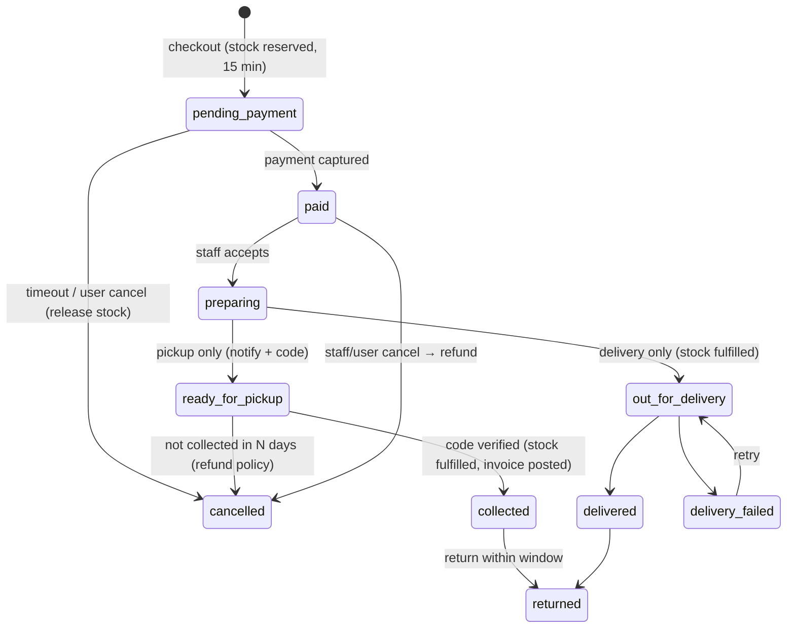

# 10 · Shop, Inventory, Click & Collect, Delivery

Problem statement: *"A member's racket string snaps ten minutes before play. Another wants new shoes and would rather order them from home and collect them at the club, or have them delivered. The club sells rackets, balls, shoes, accessories and apparel, and it should always know what is in stock and when something is running low. What a member buys at the counter and what they order from their sofa come from the same shelf."*

## 1. One shelf: `InventoryService`

All stock changes go through one method:

```js
InventoryService.move(session, { variantId, locationId, qty, type, refType, refId, reason, ctx })
```

Atomic guarded updates (inside the caller's transaction):

| Operation | Update on `stockItems` |
|---|---|
| Reserve (online order placed) | `findOneAndUpdate({variantId, locationId, $expr: {$gte: [{$subtract: ['$onHand','$reserved']}, qty]}}, {$inc: {reserved: qty}})` → null ⇒ `INSUFFICIENT_STOCK` |
| Release (order cancelled/expired) | `$inc: {reserved: -qty}` |
| Fulfil reserved (collected/dispatched) | `$inc: {onHand: -qty, reserved: -qty}` |
| Counter sale (POS) | guard `onHand - reserved >= qty` → `$inc: {onHand: -qty}` |
| Receive (purchase) | `$inc: {onHand: +qty}` |
| Return | `$inc: {onHand: +qty}` (if resellable) or `damage` move |
| Adjustment (stock count) | set via delta; reason required; approval above threshold |

Every call writes a `stockMoves` row with `onHandAfter`. After commit: if `available <= reorderLevel` → event `stock.low` (deduplicated per variant per day).

Because counter sales check `onHand − reserved`, **a shoe reserved for click-and-collect can't be sold at the counter**, and the website shows `available` — the same shelf.

Multi-line orders: reserve all lines in one transaction; any line fails → whole order fails with `details.lines` listing shortages.

Bar menu items (`kind: consumable_menu`) skip stock by default; packaged drinks can be `stocked` [RE: recipe/ingredient stock is out of scope].

## 2. Catalogue

- Categories: Rackets, Balls, Shoes, Accessories, Apparel, Strings & Grips + services (Restringing).
- Products with variants (shoe size, apparel size/colour). SKU + barcode per variant.
- Member discount: `entitlements.shopDiscountPct` applied when `product.memberDiscountEligible`.
- Images: upload via `POST /api/admin/uploads` (multer, size/type limits) to local `uploads/` in dev, S3-compatible bucket in prod (`STORAGE_DRIVER`).

## 3. Online order state machine



Also allow **pay at pickup** (`settings.allowPayAtPickup`) for members: `pending_payment` → `preparing` without payment, pay on collection at the counter.

### Click & collect
1. Browse → product → variant → cart → checkout → choose **Collect at club** + preferred date.
2. Reserve stock + create order + payment intent (transaction).
3. Paid → staff "Orders" board, column *To prepare*.
4. Staff picks items → **Mark ready** → member gets push/email with 5-char pickup code + QR.
5. At counter: scan QR or type code → order shown → verify name → **Hand over** → `collected`, stock fulfilled, invoice posted (revenueStream `shop`).

### Delivery
1. Checkout → **Deliver** → address (saved addresses) → delivery fee (`settings.deliveryFeePaise`, free above threshold; serviceable pincodes list) → pay.
2. Staff prepare → **Dispatch** (courier name/tracking ref, or "club runner") → `out_for_delivery` → **Delivered** (optional photo/OTP proof) or **Failed** (reason).
3. Delivery fee is its own invoice line `revenueStream: delivery`.

Refunds: `paid`/`preparing` cancellation → full refund to original method; after collection → return flow with credit note.

## 4. Purchasing
`purchaseOrders` draft → sent (PDF email to supplier) → receive (full/partial; each receipt creates `purchase_receipt` moves and updates `costPaise` as moving average [RE]) → vendor bill created in Finance. "Create PO from low stock" button pre-fills lines with `reorderQty` grouped by preferred supplier (also exposed to MCP).

## 5. Admin screens
| Screen | Key elements |
|---|---|
| Products | table: image, name, category, variants count, price range, available, status; filters category/channel/low stock/archived; product editor with variants matrix, images, discount eligibility, tax, channels |
| Inventory | per-variant: SKU, product, on hand, reserved, available, reorder level, value; low-stock filter; actions Adjust (reason), Receive, View moves |
| Stock moves | ledger with filters (type, date, variant, ref) |
| Online orders | Kanban: To prepare · Ready for pickup · Out for delivery · Done; list view with filters; order drawer with timeline |
| Pickup counter | big code input + QR scanner |
| Purchase orders | list + editor + receive dialog |
| Suppliers | customers tagged supplier |

## 6. API (summary — full list in [[22-API-Reference]])
`GET /api/public/products`, `GET /api/public/products/:slug`, `GET/PUT /api/cart`, `POST /api/orders/checkout`, `GET /api/me/orders`, `POST /api/me/orders/:id/cancel`, admin CRUD for products/variants/categories, `POST /api/admin/inventory/adjust`, `POST /api/admin/inventory/receive`, `GET /api/admin/inventory/low-stock`, `POST /api/admin/orders/:id/{accept,ready,collect,dispatch,deliver,fail,cancel,refund}`, `GET /api/admin/orders/by-pickup-code/:code`, purchase order CRUD + `/receive`.

## 7. Tests
- Last unit: online reserve and POS sale in parallel → exactly one succeeds.
- 20 parallel checkouts for 5 units → 5 orders, 15 `INSUFFICIENT_STOCK`, `reserved = 5`.
- Unpaid order expiry releases stock.
- Collect with wrong code → 404; with right code twice → second is idempotent no-op.
- Low-stock event fires once when crossing threshold.
