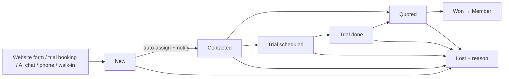

# 12 · CRM — Enquiries, Trials, Quotes, Conversion

Problem statement: *"If they could see the club, its plans and prices, what is free this week, and what the shop sells, they might book a trial session on the spot. When a visitor reaches out, that enquiry should not vanish. Someone at the club should hear about it, follow up, send a quote and, hopefully, welcome a new member."*

## 1. Pipeline

## 2. "Must not vanish" mechanics
1. Every public form submission creates a `lead` **synchronously** (the API returns only after the insert) and returns a reference number to the visitor.
2. **Auto-assignment:** round-robin among users with role `marketing` or `front_desk` who are on shift now (`shifts`), fallback to manager. Rule configurable.
3. **Notification** to the assignee (in-app + email) and an `admin:{loc}` socket toast.
4. **SLA:** `slaDueAt = createdAt + settings.leadSlaHours (default 2 h in opening hours)`. Worker `leads.sla` notifies assignee then manager when overdue; dashboard shows "Overdue enquiries".
5. Visitor gets an auto-reply email/SMS confirming receipt.
6. Dedup: same phone/email within 30 days → attach as activity to the existing open lead, don't create a new one.

## 3. Trial session
- Website "Book a free trial" → choose sport + available slot (public availability) → name/phone/email → creates `lead (source: trial_booking, stage: trial_scheduled)` + `booking (type: trial, price settings.trialPricePaise)` in one transaction (slot locks apply).
- Limit one trial per phone (`settings.trialsPerPerson = 1`).
- After the trial time passes, worker moves lead to `trial_done` and creates a follow-up task for tomorrow.

## 4. Follow-ups and activities
Lead drawer: log call/email/WhatsApp/note, set **next action** (date + note), change stage. Lists: "My follow-ups today", "Overdue". WhatsApp click-to-chat link `https://wa.me/<phone>` (no API integration required).

## 5. Quotes
- Create from lead: lines from membership plans (e.g. Gold 12 months), coaching packages, or custom (corporate court hire for a business client). Tax computed.
- Send: email with PDF + public accept link (`/quote/:publicToken`). Accept → stage `won` for membership quotes triggers **conversion**; for B2B quotes creates a customer invoice.
- `validUntil`; expired by worker.

## 6. Conversion
`LeadService.convert(leadId, {planId, months, payment})` → `MemberService.register` + `MembershipService.purchase` in one flow; lead `won`, `convertedMemberId` set; activity timeline links them. Conversion rate reported by source.

## 7. Admin screens
- **Pipeline** (Kanban by stage, drag to move, card: name, interest, source icon, assigned avatar, next action, SLA badge).
- **Leads list**: columns Name, Source, Interest, Stage, Assigned, Last contact, Next action, Created, SLA. Filters: stage, source, assignee, overdue, date. Bulk: assign, mark lost, export.
- **Lead drawer**: details, timeline of activities, quick log, quote list, convert button.
- **Quotes** list.

## 8. API
`POST /api/public/enquiries` (rate-limited, honeypot field + optional hCaptcha/Turnstile [RE]), `POST /api/public/trials`, `GET /api/public/quotes/:token`, `POST /api/public/quotes/:token/accept`, admin: leads CRUD, `/api/admin/leads/:id/{activities,assign,stage,convert}`, quotes CRUD + `/send`.

## 9. Tests
- Form submit → lead exists, assignee notified, auto-reply queued.
- Duplicate submission within 30 days attaches to existing lead.
- SLA overdue job notifies once.
- Trial booking conflicts like any booking.
- Convert creates member + active membership + invoice; lead `won`.
