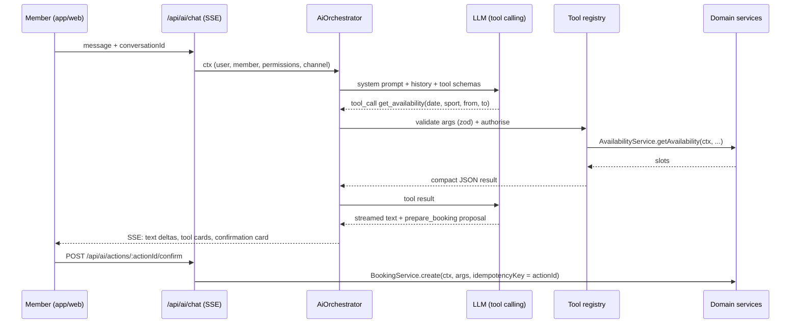

# 19 · AI Assistant (members and website guests)

Goal: replace the WhatsApp habit with an assistant that **does things**: "Book me a court tomorrow evening", "What courts are free tonight?", "How much does Gold cost?", "When does my membership expire?", "Show my previous bookings", "Find shoes under ₹5000", "Order these shoes and collect them tomorrow".

UX reference: `Reference Project/Elevate.Elly` (Phase 0 notes in `docs/Audit/ref-Elevate.Elly.md`). Port its message list, composer, streaming renderer, tool-call cards, suggested prompts and error/retry patterns. If Elly already wires an LLM provider, reuse that provider.

## 1. Architecture



Files:
```
server/src/modules/ai/
├── ai.routes.js            # POST /api/ai/chat (SSE); conversations CRUD; POST actions/:id/confirm|cancel
├── orchestrator.js         # LLM → tools → stream loop; max 6 tool rounds; 45 s timeout
├── provider/               # index.js (interface) + one driver selected by AI_PROVIDER
├── prompts/system.member.md, system.guest.md
├── tools/                  # one file per tool: { name, description, schema (zod), kind: read|write, audience, run(ctx, args) }
├── tools/index.js          # registry, filtered by audience and permissions
├── pendingActions.js       # create / confirm / expire (shared with MCP)
└── conversation.service.js
```

Provider interface: `streamChat({ system, messages, tools }) → async iterator of { type: 'text' | 'tool_call' | 'done' }`.

## 2. Tools

| Tool | Kind | Audience | Calls |
|---|---|---|---|
| `get_club_info` (hours, address, sports, contact) | read | guest, member | settings |
| `list_membership_plans` | read | guest, member | MembershipPlan |
| `get_availability(date, sport?, from?, to?)` | read | guest (statuses), member (prices) | AvailabilityService |
| `get_my_membership` | read | member | MembershipService |
| `list_my_bookings(status, limit)` | read | member | BookingService |
| `search_products(query, category?, maxPricePaise?, size?)` | read | guest, member | Catalog |
| `get_my_orders`, `get_my_tab` | read | member | Orders / POS |
| `prepare_booking(sport, start, courtId?)` | write (confirm) | member | price + availability → pending action |
| `prepare_cancel_booking(bookingId)` | write (confirm) | member | refund preview → pending action |
| `prepare_order(items[], fulfilment, pickupDate?)` | write (confirm) | member | totals + stock check → pending action |
| `create_enquiry(name, phone, interest, message)` | write (confirm) | guest, member | CRM |
| `prepare_trial(sport, start, name, phone)` | write (confirm) | guest | CRM + booking |

Rules:
- **Every write is two-phase.** `prepare_*` stores a `pendingActions` doc (TTL 10 min) and returns a summary + `actionId`. The UI renders a confirmation card ("Tennis Court 2 · Sun 4 Oct · 18:30–19:30 · ₹0 (Gold) · [Confirm] [Change]"). Only the user's tap calls `POST /api/ai/actions/:actionId/confirm`, which runs the real service with `idempotencyKey = actionId`. The model has no tool that confirms.
- Tools take identity from `ctx` of the authenticated request, never from model arguments. "My bookings" always means `ctx.memberId`.
- Tool results are compact (ids, names, times, rupee strings): no internal fields, no other members' data.
- Relative dates: the system prompt injects current date/time and `Asia/Kolkata`; tools accept ISO local date/time. Define in the prompt: morning 06:00–12:00, afternoon 12:00–17:00, evening 17:00–21:00, tonight = today 17:00–close.
- Paid confirmations return a payment intent; the client opens the normal payment sheet. The assistant never handles card data.
- Ambiguity (two courts free at 18:00, three shoes match) → the model asks or shows tappable options; tapping an option sends a structured message.

## 3. Streaming protocol (SSE)
Events: `message.start {messageId}`, `text.delta {text}`, `tool.start {name, label}` (UI: "Checking courts…"), `tool.result {name, summary, cards?}`, `action.proposed {actionId, kind, summary, expiresAt}`, `message.end {usage}`, `error {code, message}`. Mobile uses whichever SSE client Elly uses (e.g. `react-native-sse`).

## 4. Conversations
`aiConversations` / `aiMessages`. Title from the first message. Model context = last 20 messages with tool results summarised. Users can delete conversations. Admin "Assistant conversations" page lists them (read-only, `ai_admin.view`) for quality review.

## 5. Safety
- Scope: club topics only; politely declines unrelated requests; never claims an action succeeded unless confirm returned success.
- Prompt injection: tool outputs and user-generated text (product descriptions, enquiry messages) are passed as data, never as instructions.
- Limits: members 20 messages/min and 200/day; guests 10/min/IP; input ≤ 2,000 chars; `AI_MAX_TOKENS_PER_DAY` per user.
- Audit: every confirmed action → audit with `source: ai`.
- Fallback: provider down → friendly error with quick links (Book, Shop, Contact).

## 6. UI (from Elly)
Empty state with prompts based on member state ("Book tonight", "When does my plan expire?", "Find shoes under ₹5000"). Markdown messages; availability chips (tap → `prepare_booking`); product cards (image, member price, Add); confirmation cards; streaming indicator; stop button; retry on error.

## 7. Tests
- Member A cannot read member B's data through any tool argument.
- Model text claiming "booked" without confirm → no booking exists.
- Confirming twice → one booking.
- Expired action → 410, nothing created.
- Scripted routing evals (`test/ai/evals.json`, ~25 prompts) against a stub LLM; optional real-LLM run before the demo.
