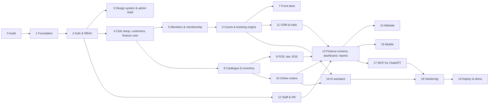

# 26 · Implementation Phases

Dependency-aware build order. Each phase is one or more PRs. Follow [[00-Cursor-Execution-Guide]] for every phase.

## Hackathon cut line
If time runs short, the **demo-critical path** is: 0 → 1 → 2 → 3 → 4 → 5 → 6 → 7 → 8 → 9 → 10 (pickup only) → 11 (enquiry + trial) → 13 (dashboard + revenue) → 14 (home, plans, availability, trial, shop) → 17 (read tools + one confirmed write) → 19. Mobile (15), AI (16), HR (12), delivery and full finance screens are next in that order. Mark anything skipped as "Planned" in the UI rather than leaving dead links.

---

## Phase 0 — Codebase and reference audit
- **Objective:** know the existing system before changing it. Full spec: [[03-Phase0-Codebase-Audit]].
- **Prerequisites:** repo cloned; `.env` with the rotated Atlas URI.
- **Files to inspect:** existing `server/`, `admin/`, every `Reference Project/*`, `github.com/mattpocock/skills`.
- **Files to create:** `docs/Audit/existing-project.md`, `folder-mapping.md`, `ref-*.md` ×8, `summary.md`; `.env.example` if missing.
- **Files to modify:** none.
- **Acceptance:** audit files complete; existing server and admin run unchanged; doc assumptions that are wrong have ADRs.
- **Potential problems:** reference projects in different languages/frameworks → record "pattern only, don't port code".
- **Rollback:** n/a (docs only).

## Phase 1 — Foundation
- **Objective:** shared infrastructure every module uses.
- **Prerequisites:** Phase 0.
- **Files to inspect:** existing app bootstrap, db connection, error handler, logger.
- **Files to create (or extend existing equivalents):** `server/src/config/index.js` (zod env), `lib/db.js` (`withTransaction`), `lib/errors.js`, `lib/money.js` (`computeLine`), `lib/time.js`, `lib/clock.js`, `lib/counters.js` (`nextNumber(key, format)`), `lib/listQuery.js`, `middleware/{validate,idempotency,rateLimit,errorHandler,requestId}.js`, `events/bus.js` (`emitAfterCommit`), `realtime/socket.js` (JWT handshake, rooms), `modules/audit/{auditLog.model,audit.service}.js`, `modules/notifications/{notification.model,notification.service}.js` (queue + in-app + email via nodemailer; SMS/push drivers stubbed), `src/worker.js` (node-cron + `jobLocks`), `seed/index.js` (runner with `--reset`), `packages/shared/{permissions,enums,money,time,tokens}.js`, `test/helpers/*` with `MongoMemoryReplSet`.
- **Files to modify:** `app.js`/`server.js` to mount middleware and sockets; `package.json` scripts (`dev`, `worker:dev`, `test`, `test:concurrency`, `seed:demo`, `db:indexes`).
- **DB:** `counters`, `auditLogs`, `idempotencyKeys`, `notifications`, `notificationTemplates`, `jobLocks`.
- **API:** `GET /api/health`, `/api/health/ready`.
- **Dependencies:** zod, pino, pino-http, helmet, express-rate-limit, date-fns, date-fns-tz, socket.io, node-cron, nodemailer, nanoid, mongodb-memory-server, supertest (only those missing).
- **Env:** see [[25-Environment-Deployment]].
- **Security:** env validation, log redaction, rate limit defaults.
- **Testing:** unit tests for money (rounding, split residue), time (IST day boundaries), counters (parallel `nextNumber` → unique sequence), idempotency middleware (parallel same key → one execution), `withTransaction` rollback.
- **Acceptance:** `npm test` green; `seed:demo` runs on empty DB; worker starts and logs job ticks; existing features unaffected.
- **Potential problems:** existing error shape differs → adapt helpers to existing shape (ADR).
- **Rollback:** additive; revert the PR.

## Phase 2 — Authentication and RBAC
- **Objective:** staff and member login, roles, permissions, audit of auth events. Spec: [[06-Auth-RBAC]].
- **Files to inspect:** existing User model, login route, JWT middleware, admin login page and API client.
- **Files to create:** `modules/auth/{permissions.js, role.model.js, refreshToken.model.js, otp.model.js, apiKey.model.js, auth.service.js, rbac.middleware.js, auth.routes.js}`, seed roles; admin `usePermission`, `<Can>`.
- **Files to modify:** existing User model (add `kind`, `roleIds`, `memberId`, `employeeId`, `tokenVersion`, `pushTokens`, `pinHash`); existing auth middleware to build `ctx`; admin API client (refresh single-flight).
- **DB:** `users` (extended), `roles`, `refreshTokens`, `otpCodes`, `apiKeys`.
- **API:** auth endpoints in [[22-API-Reference#Auth]]; admin users/roles CRUD.
- **UI:** Users & roles screens with permission matrix editor.
- **Security:** refresh rotation + reuse detection; PIN lockout; existing passwords still verify.
- **Testing:** table-driven permission tests; refresh reuse revokes family; OTP attempts; existing admin login still works.
- **Acceptance:** owner, manager, front_desk, bar_staff, finance demo users seeded; menu items hide by role; 403 on forbidden routes.
- **Potential problems:** existing tokens in localStorage → keep compatible during transition.
- **Rollback:** migration adds fields only; keep old middleware path behind a flag until verified.

## Phase 3 — Design system and admin shell
- **Objective:** the look and the reusable building blocks before screens multiply. Spec: [[21-Design-System]], [[16-Admin-Panel#2. Standard building blocks]].
- **Files to inspect:** existing admin layout, theme, components.
- **Files to create:** tokens → CSS variables; `components/{DataTable, FilterBar, EntityDrawer, FormKit/*, ConfirmDialog, StatusChip, Money, KpiTile, EmptyState, ErrorState, Skeleton, CommandPalette}`; `layouts/{AppLayout, FullscreenLayout}`; nav config with `perm` per item; `hooks/{useLiveQuery, useHotkeys}`.
- **Files to modify:** router (add route groups), existing sidebar → new IA.
- **Dependencies:** only what's missing among tailwind/shadcn/radix, @tanstack/react-query, @tanstack/react-table, react-hook-form, @hookform/resolvers, cmdk, lucide-react, recharts, socket.io-client.
- **Testing:** DataTable with mocked API (pagination/sort/filter URL sync); visual check light/dark.
- **Acceptance:** full nav renders with "Coming soon" placeholders, ⌘K works, dark mode works, a sample list page uses DataTable end-to-end.
- **Rollback:** UI only.

## Phase 4 — Club setup, customers, finance core
- **Objective:** settings and the money primitives every later module calls.
- **Files to create:** `modules/settings/{location,settings,tax}.*`; `modules/customers/*`; `modules/finance/{invoice.model, payment.model, invoice.service (createAndPost, creditNote), payment.service (record, refund), providers/{index,mock,razorpay}.js, webhook.routes.js}`; PDF helper `lib/pdf.js`.
- **DB:** `locations`, `settings`, `taxes`, `customers`, `invoices`, `payments`.
- **API:** settings, taxes, customers CRUD; `/api/webhooks/razorpay`; mock payment endpoints.
- **UI:** Settings → Club & locations, Taxes, Payments.
- **Odoo:** naming mirrors `res.partner`, `account.move`, `account.payment`, `account.tax`.
- **Testing:** invoice totals = sum of `computeLine`; credit note reverses; webhook signature fixture; mock provider confirm path; invoice numbering by financial year under concurrency.
- **Acceptance:** an invoice can be created, posted, paid (partial and full), credit-noted, and its PDF downloaded.
- **Rollback:** additive.

## Phase 5 — Members and membership
- **Spec:** [[07-Membership]].
- **Files to create:** `modules/members/*`, `modules/membership/{plan.model, membership.model, membership.service, entitlements.js, activity.consumer.js}`; worker jobs `membership.expire`, `membership.reminders`; admin pages Members, Member 360, Plans, Memberships.
- **DB:** `members`, `membershipPlans`, `memberships`, `activityEvents`.
- **Testing:** list in [[07-Membership#5. Tests]].
- **Acceptance:** register Gold/Silver/Junior at desk with payment → invoice (membership) → member active with entitlements; expiring list shows seeded members; reminder job idempotent.
- **Potential problems:** age calculation in IST at day boundaries → use `lib/time`.
- **Rollback:** additive.

## Phase 6 — Courts and booking engine ⚠️
- **Spec:** [[08-Booking-Engine]].
- **Files to create:** `modules/facilities/{sport,court,courtBlock}.*`; `modules/booking/{slotLock.model, booking.model, memberDayCounter.model, socialSession.model, socialParticipant.model, availability.service (slot generation, operating hours, locks, entitlements), pricing.service, booking.service (create, confirmPayment, cancel, reschedule, checkIn), conflictGuard.js (E11000 → domain errors, alternatives), courtBlock.service, socialSession.service, booking.routes}`; worker `holds.expire`, `bookings.complete`; `test/concurrency/booking.test.js`.
- **API:** booking rows in [[22-API-Reference]].
- **UI:** Booking calendar (resource grid), Bookings list, Courts & sports, Blocks, Social play.
- **Testing:** **all 10 concurrency cases** + pricing matrix (Gold free, Silver 50%, Junior off-peak only, walk-in peak/off-peak) + cancellation windows.
- **Acceptance:** the 50-parallel test yields exactly one booking and two locks; calendar updates live in two browsers; Friday social session fills to capacity and no more.
- **Potential problems:** WriteConflict retries under load (fine, bounded); TTL lag (handled by explicit stale-hold cleanup).
- **Rollback:** feature-flag booking routes; data additive.

## Phase 7 — Front desk
- **Spec:** [[09-Front-Desk]]. Depends on 5, 6 (and 9 for counter sale/tab buttons — show them disabled until Phase 9).
- **Files to create:** `admin/src/pages/front-desk/*` (search, court board, context panel, quick-book drawer, register drawer, hotkeys).
- **API:** reuses member search, availability/calendar, bookings, memberships.
- **Acceptance:** criteria in [[09-Front-Desk#Acceptance]].

## Phase 8 — Catalogue, inventory, purchasing
- **Spec:** [[10-Shop-Inventory-Orders#1. One shelf: InventoryService]], §2, §4.
- **Files to create:** `modules/catalog/{category,product,variant}.*`, `modules/inventory/{stockItem.model, stockMove.model, inventory.service (move), purchaseOrder.*}`, uploads route; admin Products, Inventory, Stock moves, Purchase orders, Suppliers.
- **Testing:** stock races; low-stock event once; PO receive creates moves and vendor bill.
- **Acceptance:** adjusting stock in admin is reflected in public product availability; "Create PO from low stock" works.

## Phase 9 — POS, bar, café, KDS
- **Spec:** [[11-Bar-POS]]. Port patterns from `BFS.server` per `docs/Audit/ref-BFS.server.md`.
- **Files to create:** `modules/pos/{terminal, session, posOrder, tab, floor, table}.model.js`, `{posSession, posOrder, tab, table, kds}.service.js`, `pos.routes.js`, `kds.routes.js`; admin `pages/pos/*` (terminal select, floor, order screen, payment/split, tabs, close/Z-report), `pages/kds/*`.
- **Testing:** list in [[11-Bar-POS#5. Tests]], plus 20-cashier load script.
- **Acceptance:** table order → kitchen ticket → ready toast → member discount auto-applied → split cash/UPI → tab settles → Z-report equals payments; shop counter sale reduces the same stock the website shows.

## Phase 10 — Online orders (click & collect, delivery)
- **Spec:** [[10-Shop-Inventory-Orders#3. Online order state machine]].
- **Files to create:** `modules/orders/{cart.model, order.model, checkout.service, order.service (state transitions), pickupCode.js}`; worker `orders.releaseUnpaid`; admin Online orders Kanban + Pickup counter.
- **Acceptance:** pickup flow end-to-end with notification and code; delivery flow with dispatch/delivered/failed; cancellation releases stock; refund creates credit note.

## Phase 11 — CRM, enquiries, trials, quotes
- **Spec:** [[12-CRM-Enquiries]].
- **Files to create:** `modules/crm/{lead, leadActivity, quote}.*`, `lead.service (create, dedupe, assign, convert)`, `quote.service`, worker `leads.sla`; admin Pipeline, Leads, Follow-ups, Quotes.
- **Acceptance:** website enquiry → assigned + notified < 2 s; trial booking creates lead + booking; quote accept → member conversion.

## Phase 12 — Staff and HR
- **Spec:** [[13-Staff-HR]].
- **Files to create:** `modules/hr/{employee, shift, attendance, leaveRequest, payrollRun}.*` + services; admin Employees, Roster, Attendance, Leave, Payroll.
- **Odoo:** mirrors `hr.employee`, Planning, `hr.leave`.
- **Acceptance:** roster week published; leave approve deducts balance; payroll run approved → payable → paid → appears in payables/expenses.

## Phase 13 — Finance screens, dashboard, reports
- **Spec:** [[14-Finance]], [[15-Dashboard-Reports]].
- **Files to create:** `modules/reports/{report.service (all functions in 15 §2), snapshot.job, report.routes, export.js}`; finance admin pages (Invoices, Payments, Receivables, Payables, Expenses, Reconciliation, Tax summary); Dashboard page; Reports pages.
- **Testing:** fixture-day report assertions; snapshot/live parity.
- **Acceptance:** dashboard answers each question in [[15-Dashboard-Reports#1.]]; numbers reconcile across dashboard, reports and invoices.

## Phase 14 — Public website
- **Spec:** [[17-Website]]. Create `website/` (Next.js), shared tokens, API client, pages, chat widget placeholder (wired in 16).
- **Acceptance:** criteria in [[17-Website#6. Acceptance]].

## Phase 15 — Member mobile app
- **Spec:** [[18-Mobile-App]]. Create `mobile/` (Expo). Build order: auth → home → book → my bookings → shop/cart/checkout → orders → membership → notifications → assistant tab (after 16).
- **Acceptance:** book, pay (mock), cancel, order for pickup, see pickup code, receive push for "ready".

## Phase 16 — AI assistant
- **Spec:** [[19-AI-Assistant]]. Port Elly's chat UI to website widget and mobile tab.
- **Acceptance:** all seven example requests in the spec work end-to-end with confirmation cards; authorisation tests pass.

## Phase 17 — Management MCP for ChatGPT
- **Spec:** [[20-MCP-Server]]. Create `mcp/` from project360's pattern; backend `/api/mcp/*` wrappers; admin MCP access + activity pages.
- **Acceptance:** ChatGPT answers the §4 conversation flows against the deployed instance; confirmations enforced; audit rows present.

## Phase 18 — Hardening
- **Objective:** security, performance, reliability pass.
- **Tasks:** run [[23-Security]] checklist; indexes review (`explain()` on dashboard, availability, member search, POS bootstrap); load tests (availability 200 rps, POS 20 cashiers, member search 5k members); error-path UX review (every screen has loading/empty/error); accessibility pass; `npm audit`.
- **Acceptance:** p95 targets: availability < 150 ms, member search < 200 ms, POS writes < 200 ms, dashboard < 800 ms cold / < 100 ms cached.

## Phase 19 — Deploy and demo
- **Spec:** [[25-Environment-Deployment]], [[27-Demo-Script]].
- **Acceptance:** pre-demo checklist complete; two full rehearsals timed under 13 minutes; backup recording saved.

---

## Performance plan (applies across phases)
| Risk | Mitigation |
|---|---|
| Availability grid | single indexed range query on `slotLocks`; 5 s cache per date invalidated by socket events |
| Booking calendar | one endpoint per day/sport; lean projections; virtualised rows not needed (34 rows) |
| Large member lists | server pagination, text index, `memberCode`/phone exact-match fast path, projections |
| Inventory | small collections; low-stock via indexed query; stock badges cached 10 s on website |
| POS | bootstrap once per session; small diff writes; idempotent retries |
| Reports | `dailySnapshots`, `localDate` indexes, dashboard response cache 30 s |
| AI streaming | SSE with keep-alive pings; tool results trimmed; conversation history capped |
| MCP | read endpoints reuse report cache; 60 rpm limit |
